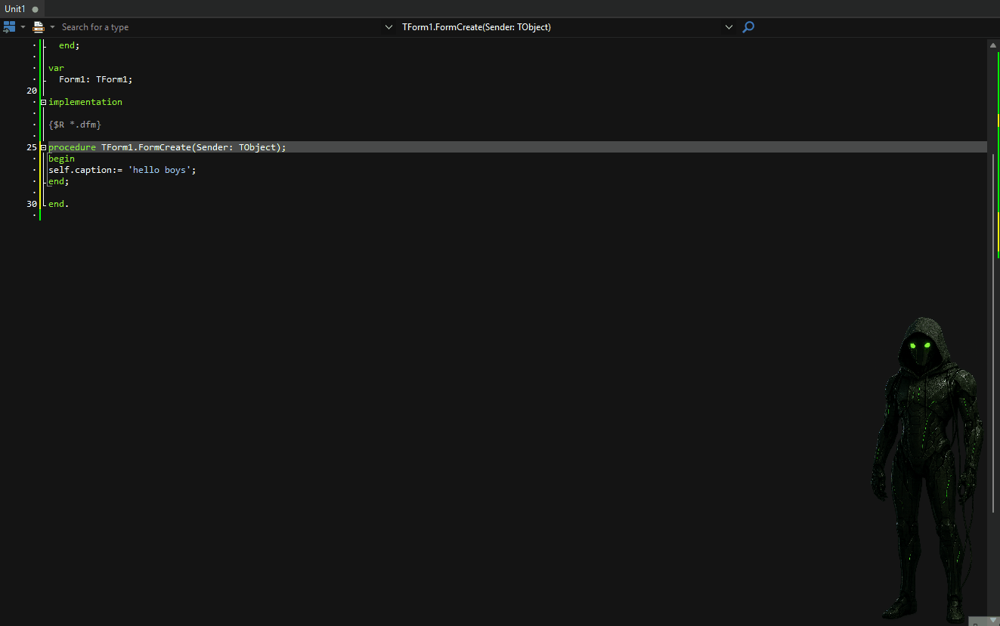
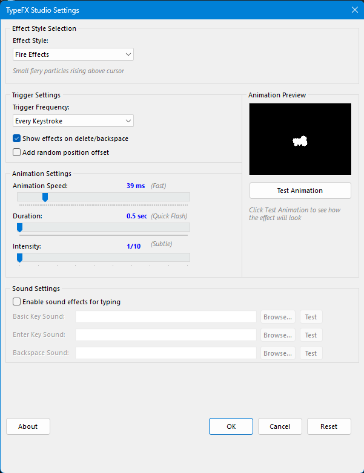

# ✨ TypeFX Studio v1.0
**Add Magical Particle Effects to Your Delphi Typing Experience**

> **🎯 What it does:** Every keystroke triggers stunning particle effects! Fire, lightning, ice crystals, plasma energy, and 13 more amazing animations that make coding feel like magic.

> **⚠️ EARLY RELEASE WARNING:** This is an early release currently in testing phase. While presumed to be working, you may encounter bugs or unexpected behavior. Please report any issues via GitHub Issues. Use at your own discretion in production environments.

> **🔊 COMING SOON:** Custom keystroke sounds! I'm planning to add customizable WAV file sounds for character presses, ENTER key, and BACKSPACE. You'll be able to browse and assign your own sound files to make typing even more satisfying!

---

## 🎬 Preview

### 🔥 **Magical Typing Effects**

### ⚙️ **Easy Configuration**  

*Transform every keystroke into a visual celebration!*

---

## ✨ Features

- 🔥 **17 Stunning Effects** - Fire, lightning, magic, ice, plasma, lasers & more!
- ⚡ **Real-Time Particles** - Professional physics simulation
- 🎛️ **Easy Configuration** - Speed, intensity, duration controls
- 👀 **Live Preview** - Test effects before applying
- ⌨️ **Smart Triggers** - Every key, word, or line options
- 🎯 **Zero Interference** - Transparent overlays, no editor disruption
- 💾 **Persistent Settings** - Your preferences saved automatically

---

## 📦 Installation

1. **Download** this repository
2. **Open** `TypeFXStudio.dpk` in Delphi
3. **Build** and **Install** the package
4. **Find** new menu items in Tools menu

---

## 🚀 Quick Start

1. **Tools → TypeFX Studio Settings...**
2. **Choose** your favorite effect (Fire is awesome!)
3. **Adjust** speed and intensity
4. **Test** with preview button
5. **Click OK** - start typing and enjoy the magic!

**Keyboard Shortcuts:**
- `Ctrl+Shift+T` - Toggle effects on/off
- `Tools Menu` - Access configuration

---

## 🎨 Amazing Effects Available

### 🔥 **Fire & Energy**
- 🔥 **Fire Burst** - Classic flame particles
- 💙 **Blue Flame** - Cool sci-fi flames  
- ⚡ **Lightning** - Electric sparks
- 🔌 **Electric Sparks** - Crackling energy
- 🌟 **Plasma** - Purple energy swirls
- 🔴 **Laser Beams** - Red laser shots

### ✨ **Magic & Fantasy**  
- 🪄 **Magic Sparkle** - Orbiting sparkles
- ⭐ **Star Burst** - Twinkling stars
- 💎 **Crystal Shards** - Prismatic fragments
- 🌈 **Rainbow Trail** - Colorful spirals

### 🌊 **Nature & Atmosphere**
- ❄️ **Ice Crystals** - Falling snowflakes
- 💨 **Smoke Wisp** - Gentle smoke
- 🌪️ **Wind Blow** - Particle breeze
- 🏆 **Gold Shower** - Golden sparkles

### 🎮 **Tech & Modern**
- 💥 **Explosion** - Particle burst
- 🖥️ **Matrix Code** - Falling characters
- 💡 **Neon Pulse** - Glowing effects

---

## ⚙️ Customization Options

| Setting | Options | Description |
|---------|---------|-------------|
| **Effect Style** | 17 choices | Pick your favorite animation |
| **Trigger** | Every key / Word / Line | When effects appear |
| **Speed** | 10-200ms | How fast they animate |
| **Duration** | 0.5-3 seconds | How long they last |
| **Intensity** | 1-10 | Size and particle count |
| **Random Offset** | On/Off | Add position variety |

---

## 🎯 Perfect For

- 🎮 **Game Developers** - Add excitement to game coding
- 🎨 **Creative Coders** - Express your artistic side
- 🎉 **Live Coding** - Impress audiences during demos
- 💻 **Daily Coding** - Make routine work more enjoyable
- 👥 **Team Fun** - Shared laughs during pair programming
- 🚀 **Motivation** - Visual feedback makes coding addictive!

---

## 🔧 Requirements

- ✅ Delphi XE2 or later
- ✅ Windows 7+
- ✅ No external dependencies
- ✅ Love for visual awesomeness!

---

## 📞 Support

- **Issues**: GitHub Issues
- **Discord**: bitmasterxor

---

**✨ Add a Little Magic To Your Code!**

**Made By BitmasterXor With ❤️ for the Delphi Community**

